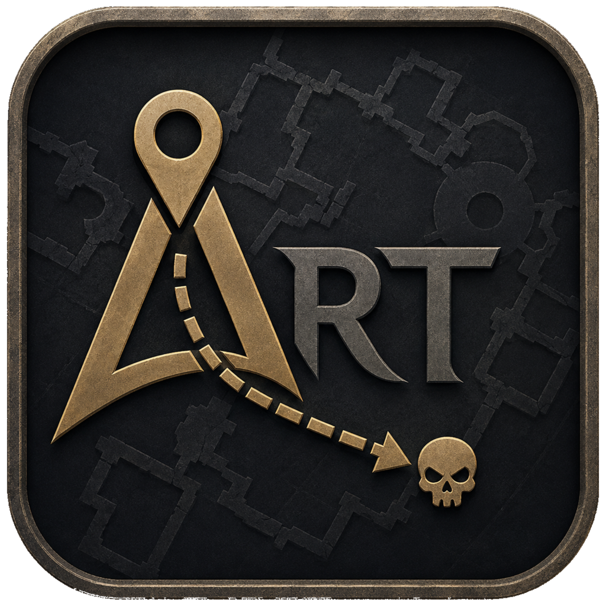

<p align="center">
  
</p>

<p align="center">
  <a href="https://github.com/marcomaiermm/AnniversaryRaidTools/releases/latest"></a>
  <a href="https://github.com/marcomaiermm/AnniversaryRaidTools/actions/workflows/release.yml"></a>
  
  <a href="LICENSE"></a>
</p>

<h1 align="center">Anniversary Raid Tools</h1>

<p align="center">
  Raid route planning and live mark coordination for WoW TBC Anniversary.
</p>

## Features

- Interactive raid maps with enemies, packs and patrol routes.
- Route planning for freely composed pulls.
- Wave planning for Battle for Mount Hyjal.
- Pull-specific and raid-wide target markers.
- Configurable mouseover and visible-nameplate marking that preserves observed
  foreign raid marks.
- Live synchronization of routes and raid progress.

## Supported Raids

- Gruul's Lair
- Magtheridon's Lair
- Serpentshrine Cavern
- The Eye
- Battle for Mount Hyjal
- Black Temple

ART supports the TBC Anniversary client interfaces `20505` and `20506`.

## Usage

- `/art` opens the planner.
- `/art minimap` toggles the minimap button.
- `/anniversaryraidtools` is an alias for `/art`.

## Development

The canonical automated runtime is PUC Lua 5.1. Install the pinned CI
dependencies (Busted `2.3.0-1` and LuaCov `0.16.0-1`) plus Bash, LuaJIT,
LuaRocks, Subversion, Python 3, and `realpath`.

```sh
./dev test       # Busted specs
./dev coverage   # Busted --coverage, then luacov
./dev check      # validate-addon.sh, then Busted
./dev static     # wowlua_ls check . (advisory)
```

Run `./dev check` before submitting a change. The existing standalone checks
under `tests/` remain part of its validation matrix. `./dev static` is advisory:
`wowlua_ls` v0.30.5 is beta and broad Classic analysis is not exact patch
authority.

The UI is a separate load-on-demand addon. In a local WoW checkout, run
`./scripts/link-dev-ui.sh` once to expose the nested UI folder as its required
sibling addon. Client-facing changes also require the manual protocol in
[`scripts/smoke-clients.md`](scripts/smoke-clients.md) on interfaces `20505`
and `20506`; `/art test` is the existing developer-only in-client suite.

See [CONTRIBUTING.md](CONTRIBUTING.md) for development rules,
[docs/testing.md](docs/testing.md) for layer selection and prerequisites, and
[docs/architecture/README.md](docs/architecture/README.md) for the two-addon
load chain and ownership boundaries. Generated files under
`Raids/TBC/Generated/` must not be edited manually.

## Architecture

The always-loaded `AnniversaryRaidTools` core owns startup, compatibility,
SavedVariables, communication, combat logging, and the public API.
`AnniversaryRaidTools_UI` depends on it and loads the planner and raid data on
demand through its private addon namespace. Both addon manifests target TBC
Anniversary interfaces `20505` and `20506`.

## License

Anniversary Raid Tools is distributed under [GPL-2.0](LICENSE).
